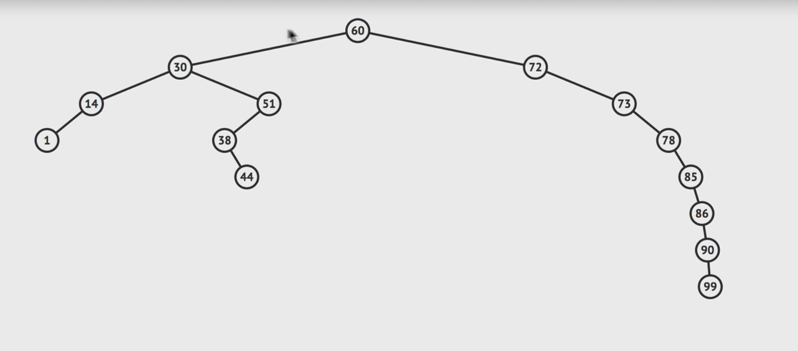

# **Trees Data Structure**

Perfect Binary tree, all leaf nodes are full and one root, bottom layer is completely filled

Full Binary tree, a node has 0 or two children but never 1 child.

Binary search tree

lookup O(log N)
insert O(log N)
delete O(log N)

How many nodes we have for each level

Level 0: 2^0 = 1
Level 1: 2^1 = 2
Level 2: 2^2 = 4
Level 3: 2^3 = 8 // nodes that we have to check to search for something

# number of nodes = 2^height - 1
(-1) because are 7 nodes at the 3rd level
log nodes = height

log 100 = 2 because 
10^2 = 100

Binary Search Tree / subset of the binary tree

Binary search tree are good at searching, great for comparing things, preserves relationships.

        101
      /     \
    33      105
  /    \    /  \
9      37 104   144

All child nodes to the right of root node must be greater to the right, if we go to the left it decreases.
A node can only have up to two children
The advantage that searching and lookup is easy, because we can start asking for each node abut the element we are searching, if it's greater or less than the current node and move either down right or down left.

In order for us to insert or delete we need to figure out where the element is located.

### The problem with binary search trees

All the nodes are being added to the right. 

So we have two types of trees

1. Balanced
2. Unbalanced

We have to remember why an unbalanced tree is bad, ideally we want a balanced tree so we can have the performance optimization as below
lookup O(log N)
insert O(log N)
delete O(log N)

### So how do you balance the tree ?

Can get complicated to do so, and in an interview they'd like to talk about, the trade-offs as there's no much time during the interview.

Binary Search Tress - do perform very well.

Pros
- Better than O(n)
- Ordered
- Flexible Size

Cons
- No O(1) operations

There is a library call Arboreal JS that helps with the tree implementation.
https://github.com/afiore/arboreal 

Balancing a tree, there are two types

AVL Tree  // no need code as we normally use a library that implement them both
Red Black Tree 

Avl trees
https://medium.com/basecs/the-little-avl-tree-that-could-86a3cae410c7
https://www.cs.usfca.edu/~galles/visualization/AVLtree.html

Red black trees
https://www.cs.usfca.edu/~galles/visualization/RedBlack.html
https://medium.com/basecs/painting-nodes-black-with-red-black-trees-60eacb2be9a5 

heap: IS A SPECIALIZED TYPE OF TREE-BASED DATA STRUCTURE, that has a heap property, there are two types,
Mini-Heap, max-Heap.

Heaps cna be represented as an array where ethe parent-child relationship can be derived using index calculations.
For a node at index `i`, its children are at indexes `2i + 1` and `2i + 2`, and its parent is at index `(i -1) // 2

        10
       /  \
     15    30
    /  \  /  \
  40   50 100 40

   In the array representation, this min-heap is stored as [10, 15, 30, 40, 50, 100, 40]

### Binary HEAPS
Why would I use ? 
Are great at comparative operations. Used in data storage, priority queues. 

### Priority Queues

