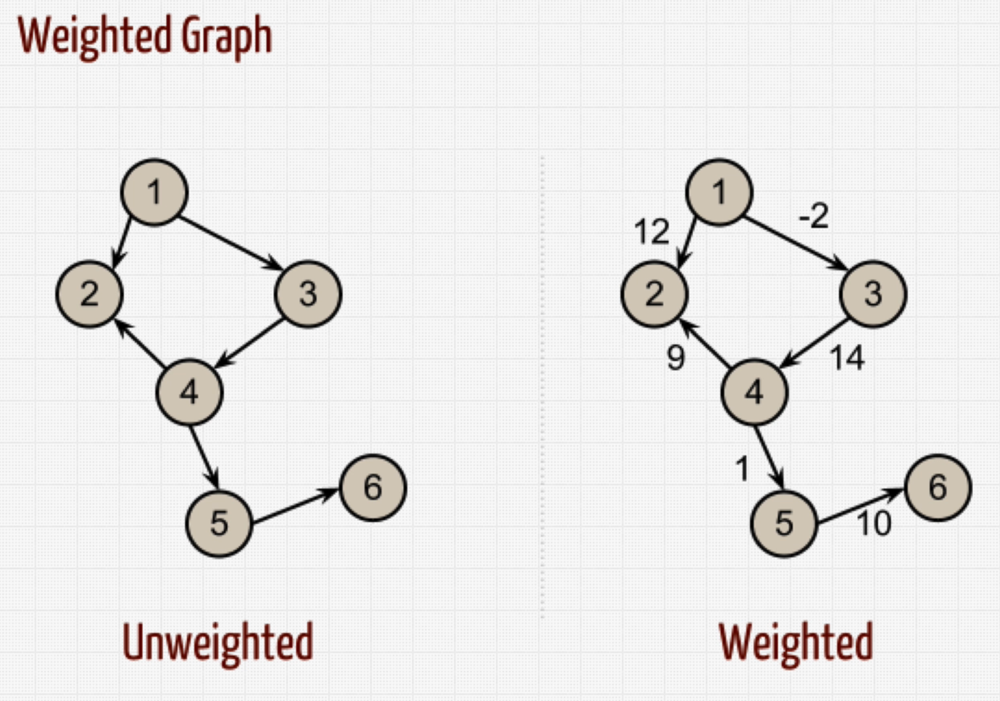
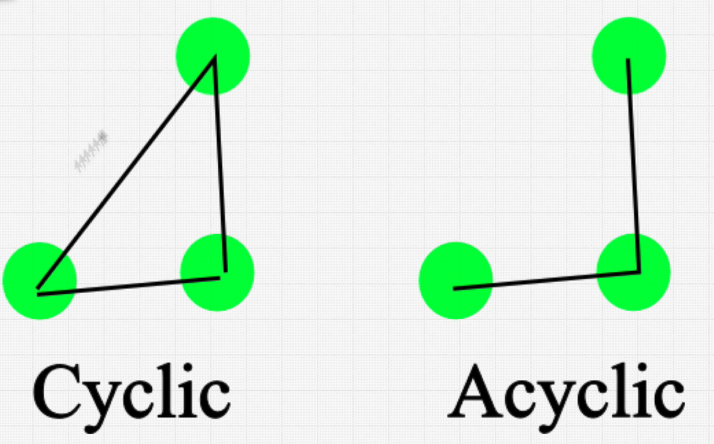
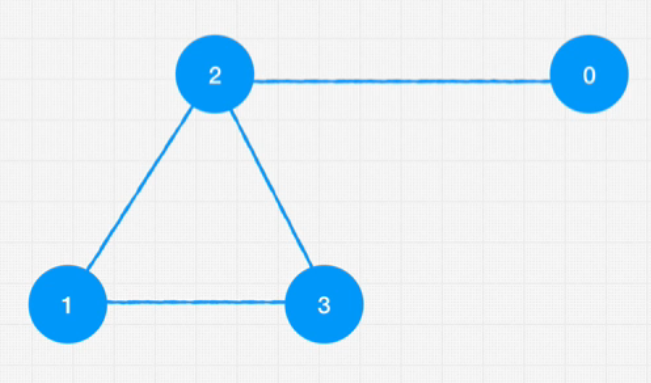

Graph

Nodes (Vertex)
Nodes connect with Edges, 

Are great to model relationships. We can use Graphs to represent networks, roads etc.

Characteristics

Directed Graph
- One way

Undirected Graph
- Two ways

## Weighted Graphs

## Cyclic/Acyclic Graphs

Graph Data

Pros and Cons

Pro: Really useful with relationship, some data needs to be in graph form.

Cons: Because they can get complicated scaling can get hard.