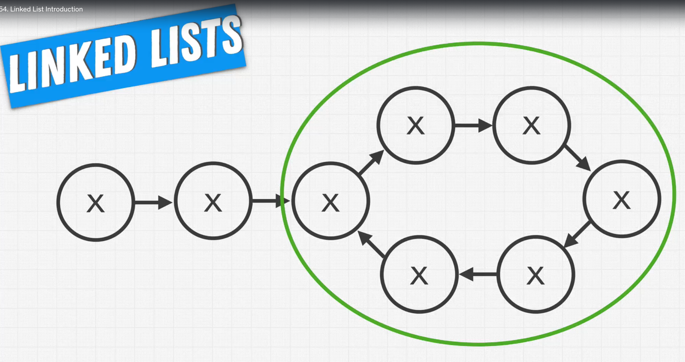

# Linked Lists

Two forms, singly linked lists.

List node: 

```javascript
class ListNode {
    value: 2;
    next: ListNode
}
```

next is a pointer to another node or null. 

We always return the Head, but we may have a cycle, where we may don't know where it begins



### Question 1:

Given a linked list, return it in reverse.

1 => 2 => 3 => 4 => 5 => null

5 => 4 => 3 => 2 => 1 => null

- What we return if we get null or a single node ?
- Just return null and the node back respectively.

Test cases
Since is simple we don't need many test cases. 

1. 1 => 2 => 3 => 4 => 5 => null **returns** 5 => 4 => 3 => 2 => 1 => null
2. 3 **returns** 3
3. null **returns** null


```javascript
function example (head) {
    let currentNode = head;
    
    while(currentNode) {
        // perform operation
        
        // set current node to the next value
        currentNode = currentNode.next;
    }
    
}
```
1. Start by thinking what we will do logically when we receive the first element.
2. 


