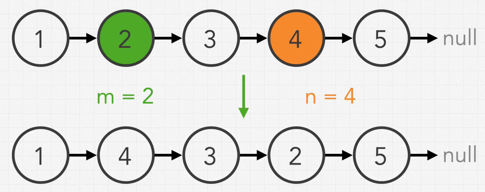

LINKED LIST

## Given a linked list and numbers m and n, return it back with only positions m to n in reverse.

## Where

### `m = 2` and `n = 4`



1. Will m and n always be within the bound of the linked list ?
    1. Yes assume 1 <= m <= n <= length of linked list.

2. Can we receive m and n values for the whole linked list ?
    1. yes.

### Steps to reverse linked list

1. get current node
2. store next value
3. update next value to list so far
4. store current node as list so far
5. update current node to stored next value at 2.
6. increment position

1 => 2 => 3 => 4 => 5 => 6 => 7 => null // m = 3 & n = 5
returns
1 => 2 => 5 => 4 => 3 => 6 => 7 => null

We keep track of `m - 1` and also keep track of `n` that represent the tail, because we need to attach the rest of the
list.
at the position `n + 1`

So the positions we are looking for ar

2 , 3 , 5 , 6
`m - 1`, `m`, `n`, `n + 1`

### Detailed Explanation:

#### `1 => 2 => 3 => 4 => 5 => 6 => 7 => null   // m = 3 & n = 5`

```javascript
const reverseBetween = function (head, m, n) {
```

The function reverseBetween takes three parameters: head, the head node of a linked list, m and n are the starting and
ending positions at which the linked list should be reversed.

```javascript
   let currentPos = 1;
let currentNode = head;
let start = head;
```

It then declares three variables: currentPos a counter for the current position in the linked list, currentNode which is
initially set to the head of the linked list, and start which is also initially set to the head of the linked list.

```javascript
while (currentPos < m) {
    start = currentNode;
    currentNode = currentNode.next;
    currentPos++;
}
```

The loop iterates through the linked list until the mth node is reached. currentNode is then at the mth node and start
is set to the node before mth.

```javascript
let newList = null;
let tail = currentNode;
```

A new newList is declared and set to null, and tail is pointed to currentNode ('mth' node).

```javascript
while (currentPos <= n) {
    const next = currentNode.next;
    currentNode.next = newList;
    newList = currentNode;
    currentNode = next;
    currentPos++;
}
```

This loop iterates from the mth position to the nth position. It reverses the pointers of the nodes within this segment.
The newList now has the reversed linked list from m to n.

```javascript
start.next = newList;
tail.next = currentNode;
```

The next of start node (node before m) is then connected to newList (the reversed linked list). Also the next of tail (
the node at m before reversal) is connected to the currentNode (node at n+1)

```javascript
if (m > 1) {
    return head;
} else {
    return newList;
}
```

Finally, if m is greater than 1, head is returned as the head of the final modified linked list. If m is 1, newList
becomes the new head. In both cases, the segment from m to n in the linked list is reversed.
