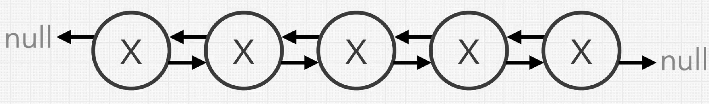
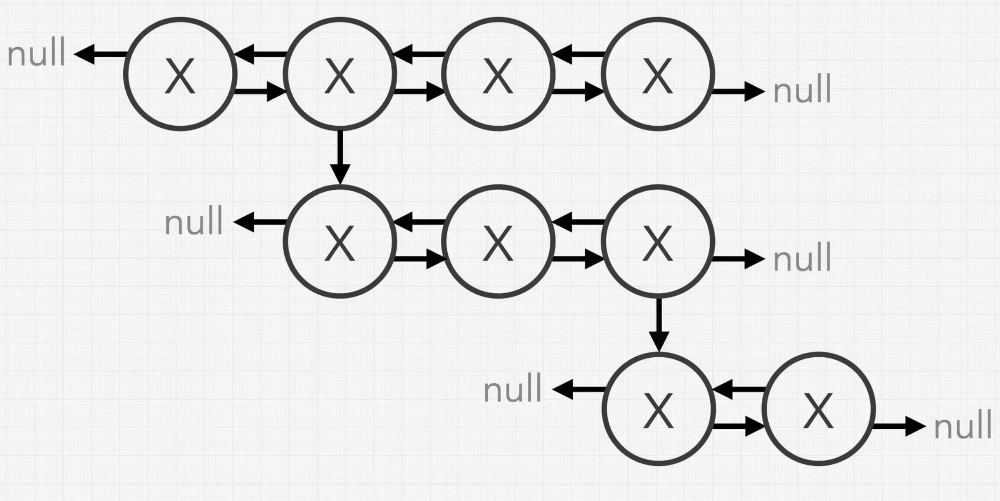
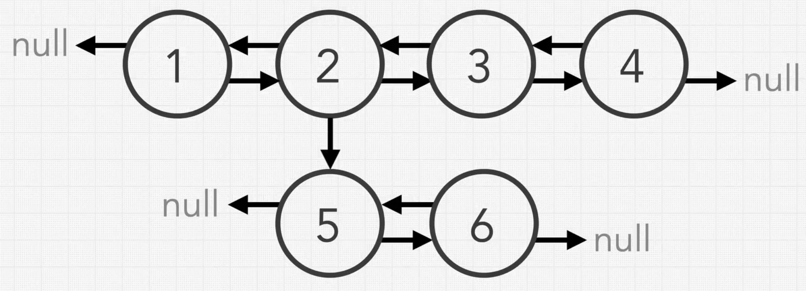
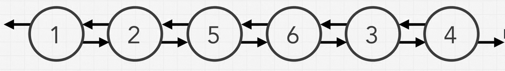
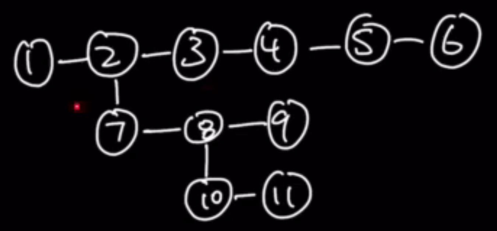
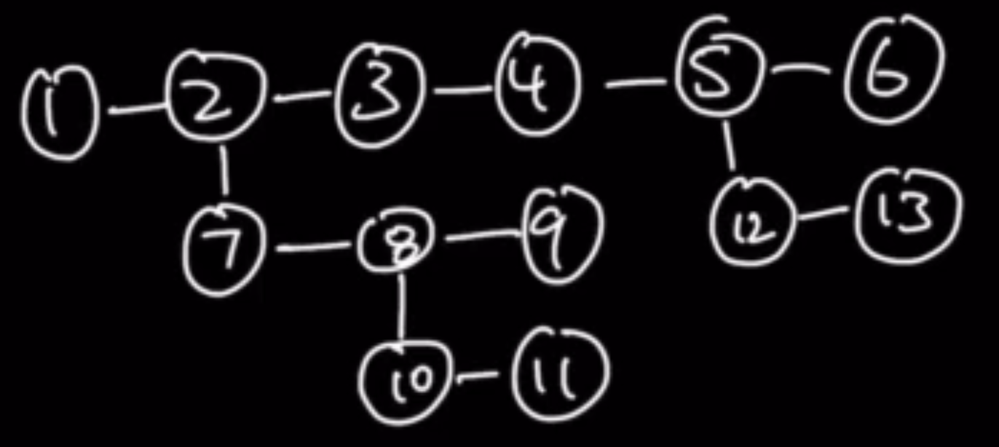
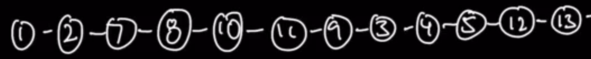
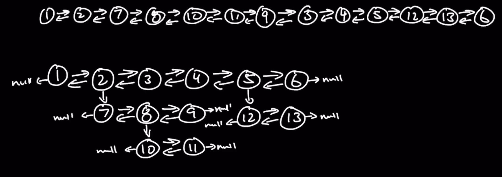

# Merge multi-level doubly Linked List


```javascript
class ListNode {
    value: any;
    prev: ListNode;
    next: ListNode;
}
```



We can now traverse forward and backward.

Given a doubly linked list, list nodes also have a child property that can point to a separate doubly linked list.
These child lists can also have one or more child doubly linked lists of their own, and so on.

Return the list as a single level flattened doubly linked list.

List node also have a child property that points to another doubly linked list. Doesn't have to have one but it may be linked to another doubly linked list.

```javascript
class ListNode {
    value: any;
    prev: ListNode;
    next: ListNode;
    child: null;
}


const flatten = function(head) {
    if (!head) return head;
    let currentNode = new ListNode(); 
    // let currentNode = head;
    while (currentNode !== null) {
        if (currentNode?.child === null) {
            currentNode = currentNode?.next || null;
        } 
    }
}
```



## Flattening process



### Results into 



We need to decide if we merge bottom up, or top down.


## Constraints

* Can a doubly linked list can have multiple child lists ?
  * Yes
* 
* What do we do with child properties after flattening ?
  * Just set the child properties value to null

## Test cases

WHAT FACTORS CAN AFFECT THE ORDER ?
MULTIPLE LEVELS MAY INFLUENCE THE OUTCOME. 



MULTIPLE ELEMENTS AT DIFFERENT LEVELS CAN AFFECT THE ORDER ?



WHAT WOULD BE THE OUTCOME, WHAT'S THE FLOW OF MERGING ?

## **RESULTS INTO**




Final Test Case




What we need to think what it's important when merging the list, so in our example the important values are 2 and 3. 

code solution in section-10-00.js file
