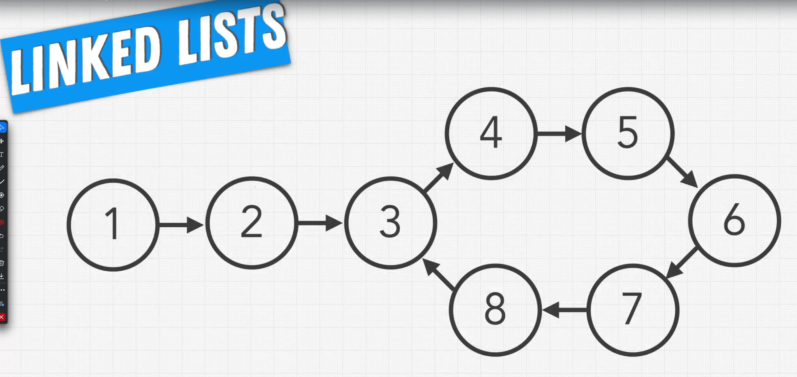
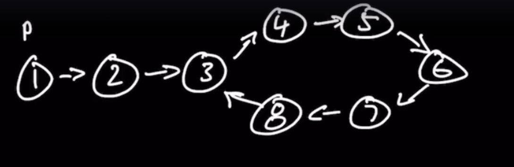

Linked List, Cycles





Solution to the problem

```javascript
const findCycle = function (head) {
    let currentNode = head;

    const seenNode = new Set();

    while (!seenNode.has(currentNode)) {
        if (currentNode.next === null) {
            return false;
        }
        seenNode.add(currentNode);
        currentNode = currentNode.next;
    }

    return currentNode;
}

```
## Floyd's Cycle detection algorithm

The tortoise and the hare algorithm is also known as Floyd's Cycle detection algorithm. It's often used to detect cycles
in various data structures such as linked lists. Here is an example implementation in JavaScript:

```javascript
function hasCycle(head) {
    if (head === null) return false;

    var tortoise = head, hare = head;

    while (hare !== null && hare.next !== null) {
        tortoise = tortoise.next;
        hare = hare.next.next;

        if (tortoise === hare) return true;
    }

    return false;
}
```

In this code:

This function assumes that the list nodes have a next property that can be null (at the end of the list) or reference
another node.

The hasCycle function takes a linked list head as a parameter.
If the head is null, it immediately returns false, as a null list cannot have a cycle.
It then declares two pointers: tortoise and hare. The tortoise moves one step at a time, while the hare moves two steps
at a time.
In the loop, as long as hare is not null and hare.next is also not null (meaning that we haven't reached the end of the
list), tortoise and hare keep moving forward.
If at any point tortoise and hare are pointing to the same node, that means we found a cycle, so we return true.
If the loop finishes without finding any cycle, we return false, indicating there's no cycle in the list.