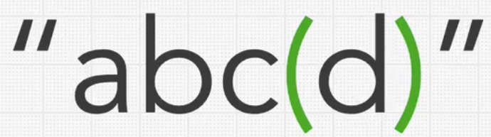
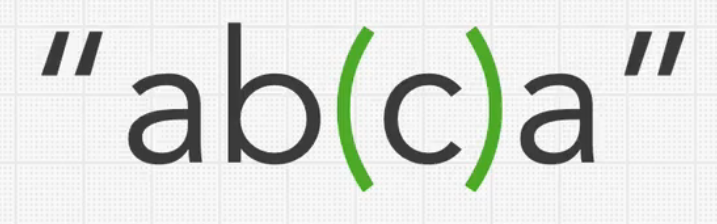
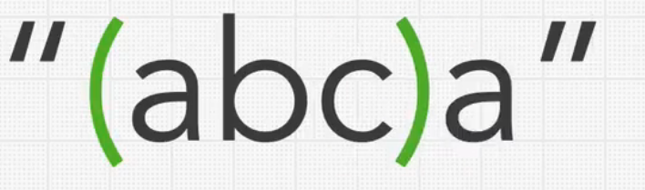
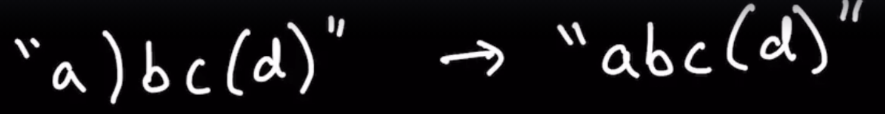
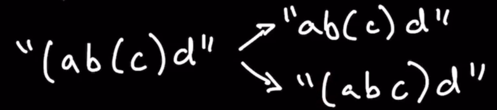
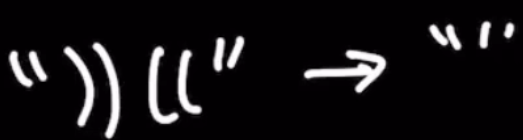

Stacks - Minimum Brackets to Remove 

Given a string only containing round brackets () and lowercase characters, remove the least amount of brackets so the 
string is valid.

A string is considered valid if it is empty or if there are brackets, they all close.

Valid String

Constraints

* What do we return from our algorithm ?
  * Return a valid string with the fewest brackets removed.
* Will there be spaces in the string ?
  * No
* Is the string containing only lowercase characters valid ?
  * Yes, don't need any brackets for string to be considered valid.

Test Cases

